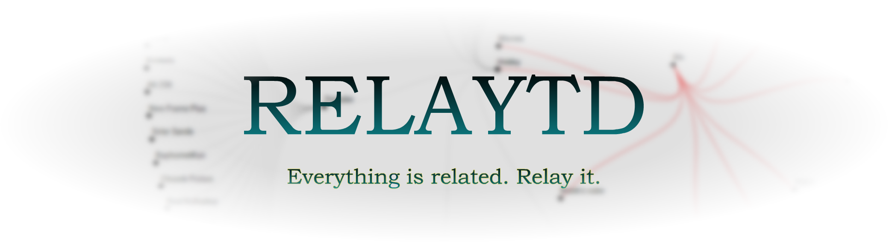

(Back-end)  
<> See Front-End ~~and usage~~ at [Overlaytd](https://github.com/Stickykenny/Overlaytd) <>

Web-application to centralize my own interests

### Main Technical Stack

**Front-end** | **Back-end**    
Angular 19 | Java 21 -  
------- Typescript 5 | Spring Boot 3.4   
Bootstrap | Maven -  
. Ag Grid 32 | PostgreSQL

<b>Others : </b>

Spring Security  
Maven  
JPA : Hibernate ORM implementation

### Implementation feature

#### Main

Back-end
> - CRUD Operation with PostgreSQL database
> - DTO (Data Transfer Object) Usage
> - Swagger integrated
> - Logging with Logback
> - Unit Test with Junit 5 and Mockito

Front-end

> - API call to Back-end
> - HttpInterceptorFn Used for JWT token
> - Add/Send new entries
> - Toast Notification with ngx-toastr

#### Security

- Spring Security Filter Chain : CORS and role-based access
- User Authentification with Database and In-Memory
- OAuth 2.0 with Github or Google
- JWT token generation and requirement through cookies (http-only)
- CSRF is disabled and not needed but implementation is commented and still available to see

#### Deprecated

- Server UI with Thymeleaf => now moved to a proper Back-end
- CSRF interceptor => doesn't have a usage when using JWT on SPA

#### Comments

- Looking into ways to introduce custom animations and procedural animations with layers into the web-app
- I am leaving the comments as they are a learning points in this project
- Changed Path Variables endpoints to Endpoint using Request Body, Path Variables are too restricted due to URI (no "/",
  no spaces)

#### Plan

*I am still thinking about if I want to make public all of my todolist/desire to implement and learn new techs*  
Current shared (not updated): [Todo](TODO.md)

### Others

*I understand that some of the technologies used might be overkill for a project like this, but it's a learning and
testing project where I'm exploring how to configure and work with various tools.*  
See Linked UI : https://github.com/Stickykenny/Overlaytd  
Originated from this side-project : https://github.com/Stickykenny/Playground/tree/main/relaytd 